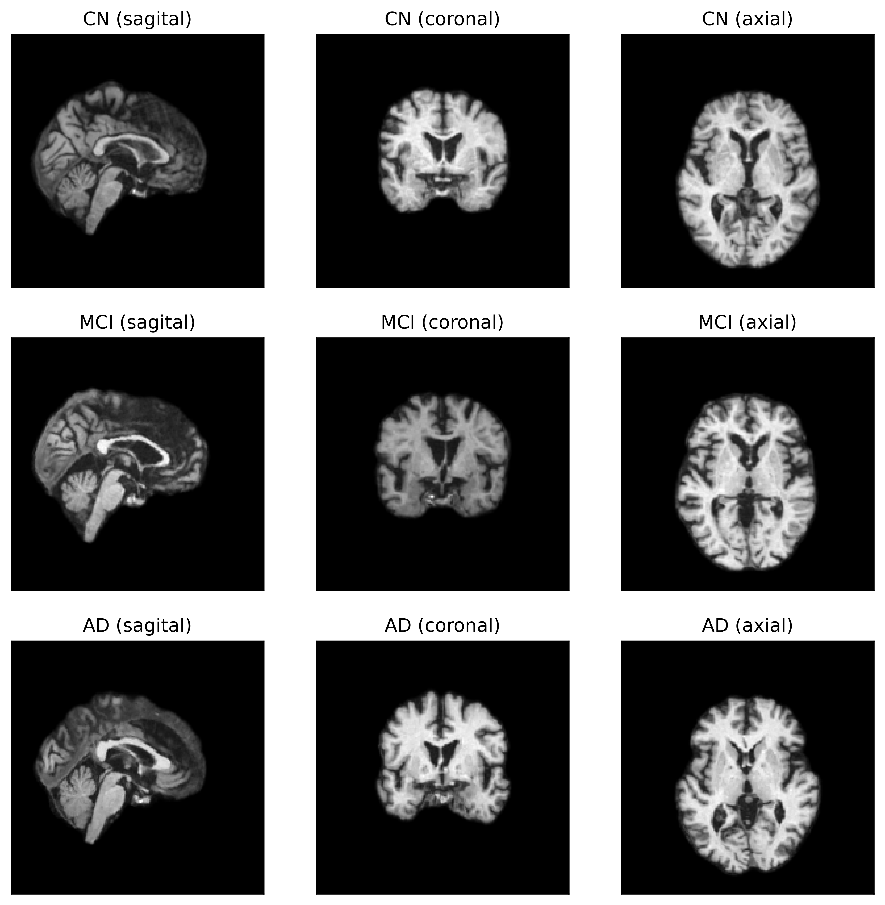
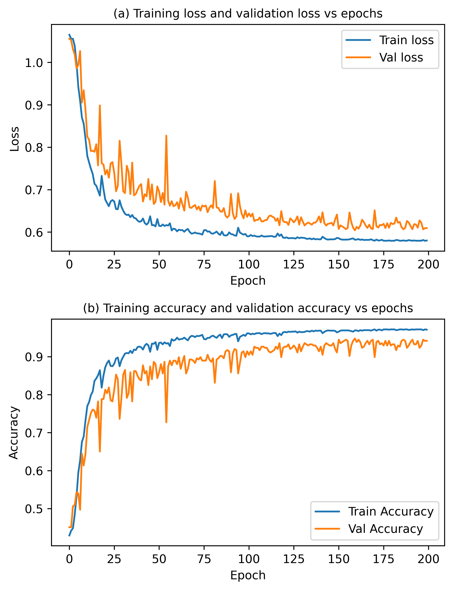

# Enhancing MRI-Based Classification of Alzheimer’s Disease with Explainable 3D Hybrid Compact Convolutional Transformers

## Overview

This repository contains the implementation of a novel deep learning model, 3D Hybrid Compact Convolutional Transformers (3D HCCT), designed for classifying Alzheimer's disease (AD) using 3D MRI scans. The model combines the strengths of Convolutional Neural Networks (CNNs) and Vision Transformers (ViTs) to capture both local features and long-range relationships within MRI data, enhancing diagnostic accuracy and interpretability.

## License
[](https://www.gnu.org/licenses/gpl-3.0)

## Key Features
- Hybrid Architecture: Combines 3D CNNs for local feature extraction and ViTs for global context.
- End-to-End Pipeline: Includes pre-processing, model training, evaluation, and explainability analysis.
- Explainability: Provides heatmap visualizations highlighting key brain regions involved in classification.
- State-of-the-Art Performance: Achieves superior accuracy and generalization on the ADNI dataset compared to existing models.

## Methodology

### Data Preprocessing:
- Skull stripping and intensity normalization using Neural Pre-processing Python (NPPY).
- MRI scans resized to 192x192x192 for computational efficiency.

| View of processed MRI scans from 3 different plane |
|---|
|  |

### Model Architecture:
- 3D Convolutional Encoder: Extracts local features.
- ViT Encoder: Captures long-range dependencies.
- Hybrid Pooling: Combines class tokens and sequential pooling for effective classification.

| A schematic view of proposed end-to-end framework |
|---|
|  |


### Training and Evaluation:

- Dataset: Alzheimer's Disease Neuroimaging Initiative (ADNI).
- Hardware: Trained on a single NVIDIA GeForce RTX-4090 GPU.


## Results
### Best Model Performance:
- Accuracy: 96.06% (Fine-tuned model with 3-layer ViT encoder).
- Outperforms several state-of-the-art models on ADNI dataset.

| Train and Validation Metrics | Heatmap Visualization of Test MRI scans from each class |
|---|---|
| | 

## Getting Started

### Prerequisites

#### Python Libraries
```
einops==0.7.0
matplotlib==3.7.2
nibabel==5.2.0
numpy==1.25.2
pandas==2.1.4
Pillow==9.0.1
Pillow==10.2.0
prettytable==3.9.0
scikit_learn==1.3.0
scipy==1.11.4
torch==2.1.2
torchvision==0.16.2
nppy==0.2.1
```

#### GPU
CUDA-compatible GPU (optional but recommended)

### Installation

#### Clone this repository:
```
git clone https://github.com/arindammajee/Alzheimer-Detection-with-3D-HCCT.git
cd Alzheimer-Detection-with-3D-HCCT
```

#### Install the required packages:
```
pip install -r requirements.txt
```

#### Data Preparation:

- Download the ADNI dataset (follow appropriate access guidelines).
- Download NPPY model for skull stripping.
- Preprocess the data using provided scripts - `ViT/3D Tensor Creation.py`. Before that, update the file paths.

#### Training:

All training scripts support patient-wise stratified 5-fold cross-validation via `--fold`.

**Single fold:**
```
python "ViT/3D ViT with Convolution-Hybrid.py" --fold 0
```

**Full 5-fold CV (prints per-fold results + mean/std):**
```
python "ViT/3D ViT with Convolution-Hybrid.py" --fold all
```

`--fold` accepts `0`, `1`, `2`, `3`, `4`, or `all`. The same argument works for all scripts:
- `ViT/3D ViT with Convolution-Hybrid.py`
- `ViT/3D ViT with Convolution-CCT.py`
- `ViT/3D ViT with Convolution-Hybrid-FineTune.py`
- `ViT/Ablation Studies/3D Hybrid-ViT Ablation Studies.py`
- `ViT/Ablation Studies/3D Hybrid-ViT Ablation Studies-FineTune.py`

Before running, update `TENSOR_PATH` and `CSV_PATH` in `ViT/fold_split.py` to match your data location.

#### Visualization:
- For Visualization visit the `visualization` branch of this repository.
- Or you can use the script `Visualization.py`.


## Citation

If you use this work in your research, please cite:
```
@article{majee2024hcct,
  title={Enhancing MRI-Based Classification of Alzheimer’s Disease with Explainable 3D Hybrid Compact Convolutional Transformers},
  author={Arindam Majee, Avisek Gupta, Sourav Raha, Swagatam Das},
  journal={To be published},
  year={2024}
}
```

## Acknowledgments

We thank the Alzheimer’s Disease Neuroimaging Initiative (ADNI) for providing the dataset and all contributors for their support.
